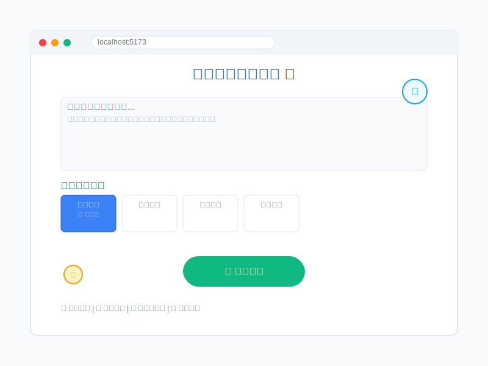

# 长文本转图片应用 📸


一个智能的长文本转图片应用，能够将长文本内容转换为多张精美的图片，支持多种风格和智能内容分割。

## 🌟 在线演示

- **演示地址**：[点击体验](http://localhost:5173) (本地运行)
- **API文档**：[Swagger UI](http://localhost:8000/docs) (本地API)

## 📸 应用截图



*长文本转图片应用主界面，支持智能文本分割和多种图片风格选择*

## ✨ 主要功能

- 🎯 **智能文本分割**：自动将长文本分割为适合的段落
- 🎨 **多种图片风格**：支持现代简约、温馨治愈、商务专业等多种风格
- 🖼️ **风格统一**：确保生成的多张图片保持一致的视觉风格
- 📱 **响应式设计**：完美适配手机、平板和电脑端
- ⚡ **实时预览**：支持提示词编辑和实时预览
- 🔧 **智能优化**：自动优化提示词格式和内容长度

## 🚀 快速开始

### 环境要求

- Node.js 16+ 
- Python 3.8+
- npm 或 yarn

### 安装步骤

1. **克隆项目**
```bash
git clone https://github.com/Syyj-1013/long-text-to-images-app.git
cd long-text-to-images-app
```

2. **安装后端依赖**
```bash
cd backend
pip install -r requirements.txt
```

3. **安装前端依赖**
```bash
cd ../frontend
npm install
```

4. **配置环境变量**
```bash
cd ../backend
cp .env.example .env
# 编辑 .env 文件，配置必要的API密钥
```

### 运行应用

1. **启动后端服务**
```bash
cd backend
python -m uvicorn main:app --host 0.0.0.0 --port 8000 --reload
```

2. **启动前端服务**
```bash
cd frontend
npm run dev
```

3. **访问应用**
- 前端地址：http://localhost:5173
- 后端API：http://localhost:8000

## 📁 项目结构

```
long-text-to-images-app/
├── backend/                 # 后端服务
│   ├── main.py             # FastAPI主应用
│   ├── requirements.txt    # Python依赖
│   ├── .env               # 环境变量配置
│   └── Dockerfile         # Docker配置
├── frontend/               # 前端应用
│   ├── src/
│   │   ├── App.vue        # 主应用组件
│   │   ├── main.js        # 应用入口
│   │   └── assets/        # 静态资源
│   ├── package.json       # 前端依赖
│   └── vite.config.js     # Vite配置
├── deploy/                 # 部署配置
│   ├── docker-compose.yml # Docker Compose配置
│   ├── nginx/             # Nginx配置
│   └── deploy.sh          # 部署脚本
└── README.md              # 项目说明
```

## 🎨 支持的图片风格

- **现代简约**：简洁明快的现代设计风格
- **温馨治愈**：温暖舒适的治愈系风格
- **商务专业**：正式专业的商务风格
- **文艺清新**：清新自然的文艺风格
- **科技未来**：现代科技感的未来风格
- **复古怀旧**：经典复古的怀旧风格

## 🔧 使用方法

1. **输入文本**：在首页输入需要转换的长文本
2. **选择风格**：选择喜欢的图片风格
3. **智能分割**：系统自动将文本分割为合适的段落
4. **编辑提示词**：可以手动调整生成的提示词
5. **生成图片**：点击生成按钮创建图片
6. **下载保存**：下载生成的图片到本地

## 🛠️ 技术栈

### 前端
- **Vue.js 3**：现代化的前端框架
- **Vite**：快速的构建工具
- **CSS3**：响应式样式设计

### 后端
- **FastAPI**：高性能的Python Web框架
- **Uvicorn**：ASGI服务器
- **Pydantic**：数据验证和序列化

### 部署
- **Docker**：容器化部署
- **Nginx**：反向代理和静态文件服务
- **Docker Compose**：多容器编排

## 🚀 部署指南

### Docker部署

1. **构建并启动服务**
```bash
docker-compose up -d
```

2. **访问应用**
- 应用地址：http://localhost
- API文档：http://localhost/api/docs

### 手动部署

详细的部署指南请参考 [deploy/README.md](deploy/README.md)

## 🤝 贡献指南

欢迎提交Issue和Pull Request来帮助改进项目！详细的贡献指南请查看 [CONTRIBUTING.md](CONTRIBUTING.md)

1. Fork 项目
2. 创建特性分支 (`git checkout -b feature/AmazingFeature`)
3. 提交更改 (`git commit -m 'Add some AmazingFeature'`)
4. 推送到分支 (`git push origin feature/AmazingFeature`)
5. 开启 Pull Request

## 📊 项目统计

- ⭐ **Star数量**：如果觉得有用请给个Star
- 🍴 **Fork数量**：欢迎Fork并改进
- 📝 **Issues**：[查看问题](https://github.com/Syyj-1013/long-text-to-images-app/issues)
- 🔀 **Pull Requests**：[查看PR](https://github.com/Syyj-1013/long-text-to-images-app/pulls)

## 📄 许可证

本项目采用 MIT 许可证 - 查看 [LICENSE](LICENSE) 文件了解详情

## 📞 联系方式

如有问题或建议，请通过以下方式联系：

- 📧 **GitHub Issues**：[提交问题](https://github.com/Syyj-1013/long-text-to-images-app/issues)
- 💬 **讨论区**：[GitHub Discussions](https://github.com/Syyj-1013/long-text-to-images-app/discussions)
- 🐛 **Bug报告**：使用Issue模板报告问题
- 💡 **功能建议**：欢迎提出新功能想法

## 🙏 致谢

感谢所有为这个项目做出贡献的开发者！

---

⭐ 如果这个项目对你有帮助，请给它一个星标！